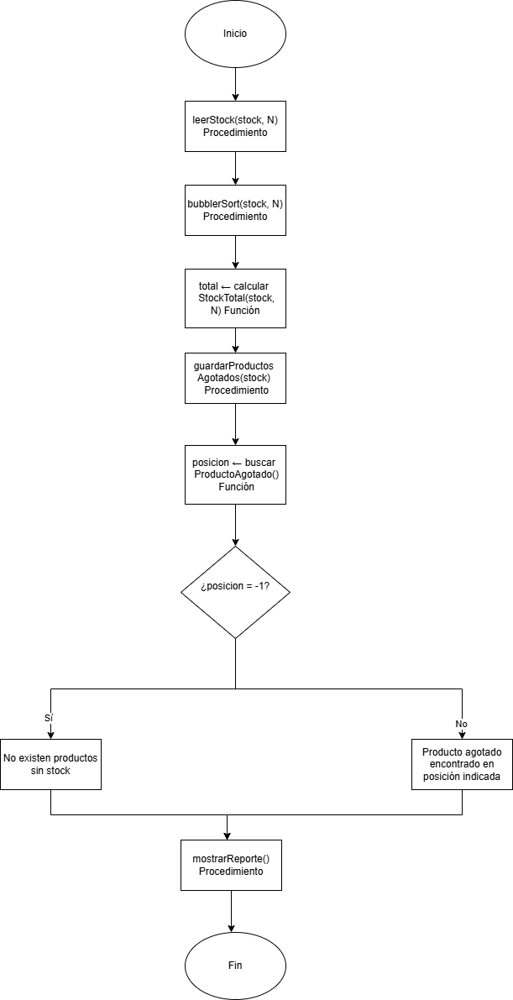

## 1. Descripción del sistema
```En este proyecto desarrollé un sistema para controlar el stock de productos de una tienda en línea. El objetivo principal es ayudar a revisar las existencias disponibles, organizar la información del inventario y detectar los productos que necesitan reposición.

Para realizar este proceso dividí el algoritmo en diferentes módulos, donde cada uno tiene una responsabilidad específica. Primero tengo un procedimiento encargado de leer los datos ingresados y validar que las cantidades de stock sean correctas, evitando valores negativos. Luego utilizo un procedimiento de ordenamiento mediante Bubble Sort para organizar las existencias de los productos.

También desarrollé una función para calcular el total de unidades disponibles y una función de búsqueda que permite identificar productos agotados. Como mejora respecto al algoritmo realizado en la Semana 2, ahora el sistema puede manejar varios productos sin stock y guardar todas las posiciones donde se encuentran.

Finalmente, el sistema muestra un reporte con la información procesada, incluyendo el stock ordenado, la cantidad total de unidades disponibles y los productos que necesitan reposición.
Entrada: cantidad de productos y unidades disponibles de cada producto.
Salida: arreglo ordenado, total de unidades disponibles y posiciones de productos sin stock. ```

## 2.Pseudocódigo Modulo 1: leerStock

// Procedimiento: lee los datos de stock y valida que no existan valores negativos
PROCEDIMIENTO leerStock(stock: ARREGLO, N: ENTERO)
VARIABLES
    i : ENTERO
    existencia : ENTERO

INICIO

    PARA i ← 1 HASTA N HACER

        ESCRIBIR "Ingrese el stock del producto ", i
        LEER existencia

        MIENTRAS existencia < 0 HACER

            ESCRIBIR "Error: el stock debe ser mayor o igual a cero"
            LEER existencia

        FIN_MIENTRAS

        stock[i] ← existencia

    FIN_PARA
FIN_PROCEDIMIENTO

## Modulo 2: bubbleSort
// Procedimiento: ordena el arreglo utilizando Bubble Sort optimizado
PROCEDIMIENTO bubbleSort(stock: ARREGLO, N: ENTERO)

VARIABLES
    i : ENTERO
    j : ENTERO
    temp : ENTERO
    huboIntercambio : LOGICO

INICIO

    PARA i ← 1 HASTA N - 1 HACER

        huboIntercambio ← FALSO

        PARA j ← 1 HASTA N - i HACER

            SI stock[j] > stock[j + 1] ENTONCES

                temp ← stock[j]

                stock[j] ← stock[j + 1]

                stock[j + 1] ← temp

                huboIntercambio ← VERDADERO

            FIN_SI

        FIN_PARA

        SI huboIntercambio = FALSO ENTONCES

            ROMPER

        FIN_SI

    FIN_PARA

FIN_PROCEDIMIENTO

## Modulo 3: calcularStockTotal
// Función: calcula y retorna la cantidad total de unidades disponibles

FUNCIÓN calcularStockTotal(stock: ARREGLO, N: ENTERO): ENTERO

VARIABLES
    i : ENTERO
    total : ENTERO

INICIO

    total ← 0

    PARA i ← 1 HASTA N HACER

        total ← total + stock[i]

    FIN_PARA

    RETORNAR total

FIN_FUNCIÓN

## Modulo 4: buscarProductoAgotado
// Función: busca la primera posición donde existe un producto sin stock

FUNCIÓN buscarProductoAgotado(stock: ARREGLO, N: ENTERO): ENTERO

VARIABLES
    i : ENTERO

INICIO

    PARA i ← 1 HASTA N HACER

        SI stock[i] = 0 ENTONCES

            RETORNAR i

        FIN_SI

    FIN_PARA


    RETORNAR -1

FIN_FUNCIÓN

## Modulo 5: guardarProductosAgotados
// Procedimiento: guarda todas las posiciones donde el stock es igual a cero
PROCEDIMIENTO guardarProductosAgotados(stock: ARREGLO,
                                        productosAgotados: ARREGLO,
                                        N: ENTERO,
                                        cantidadAgotados: ENTERO)

VARIABLES
    i : ENTERO

INICIO

    cantidadAgotados ← 0

    PARA i ← 1 HASTA N HACER

        SI stock[i] = 0 ENTONCES

            cantidadAgotados ← cantidadAgotados + 1

            productosAgotados[cantidadAgotados] ← i

        FIN_SI

    FIN_PARA

FIN_PROCEDIMIENTO

## Modulo 6: mostrarReporte
// Procedimiento: muestra los resultados finales del sistema

PROCEDIMIENTO mostrarReporte(stock: ARREGLO,
                              N: ENTERO,
                              total: ENTERO,
                              productosAgotados: ARREGLO,
                              cantidadAgotados: ENTERO)

VARIABLES
    i : ENTERO

INICIO

    ESCRIBIR "----- Reporte de Inventario -----"

    ESCRIBIR "Stock ordenado:"

    PARA i ← 1 HASTA N HACER

        ESCRIBIR stock[i]

    FIN_PARA


    ESCRIBIR "Total de unidades disponibles: ", total


    SI cantidadAgotados > 0 ENTONCES

        ESCRIBIR "Productos sin stock encontrados:"

        PARA i ← 1 HASTA cantidadAgotados HACER

            ESCRIBIR "Producto en posición: ", productosAgotados[i]

        FIN_PARA

    SINO

        ESCRIBIR "No existen productos sin stock"

    FIN_SI

FIN_PROCEDIMIENTO

## Algoritmo principal
ALGORITMO ControlStockProductos
VARIABLES

    N : ENTERO
    stock : ARREGLO[100] DE ENTERO
    productosAgotados : ARREGLO[100] DE ENTERO
    total : ENTERO
    cantidadAgotados : ENTERO
    posicion : ENTERO


INICIO

    ESCRIBIR "Ingrese la cantidad de productos:"
    LEER N


    leerStock(stock, N)


    bubbleSort(stock, N)


    total ← calcularStockTotal(stock, N)


    guardarProductosAgotados(stock,
                              productosAgotados,
                              N,
                              cantidadAgotados)


    posicion ← buscarProductoAgotado(stock, N)


    mostrarReporte(stock,
                   N,
                   total,
                   productosAgotados,
                   cantidadAgotados)

FIN

## 3. Análisis de complejidad 
| Módulo                   | Tipo                | Complejidad | Justificación                                                                                      
| leerStock                | Procedimiento       | O(n)        | Recorre todos los productos una vez para leer y validar los valores ingresados

| bubbleSort               | Procedimiento       | O(n²)       | Utiliza dos ciclos anidados para comparar e intercambiar elementos del arreglo.  

| calcularStockTotal       | Función             | O(n)        | Recorre el arreglo una sola vez para sumar todas las existencias.                                
| buscarProductoAgotado    | Función             | O(n)        | En el peor caso debe revisar todos los productos para encontrar o descartar un stock igual a cero. 

| guardarProductosAgotados | Procedimiento       | O(n)        | Recorre todos los productos para almacenar las posiciones sin stock.                               
| mostrarReporte           | Procedimiento       | O(n)        | Recorre los elementos del arreglo para mostrar la información del inventario.                      

| Sistema completo         | Algoritmo principal | O(n²)       | Bubble Sort es el módulo con mayor complejidad y determina el costo total del sistema.             

## 4. Tabla de pruebas
| Caso   | Entrada utilizada             | Resultado esperado                                        | ¿Coincide?                                                                     
| Normal | N=5. Stock: (25, 0, 10, 0,40) | Stock ordenado: (0,0,10,25,40). Total: 75 unidades. Productos agotados en posiciones 2 y 4.| Sí  

| Límite | N=1. Stock: (0)               | Stock ordenado: (0). Total: 0 unidades. Producto agotado encontrado en posición 1.| Sí

| Error  | N=3. Stock: (5,10,20). Buscar producto sin stock. | La búsqueda retorna -1 y muestra que no existen productos agotados.| Sí  


## 5. Diagrama de flujo



